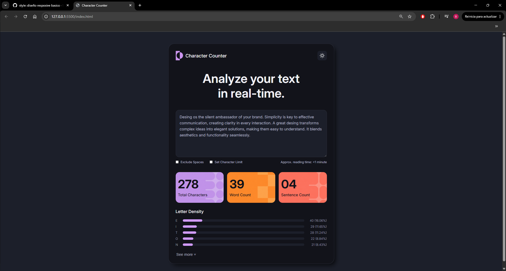
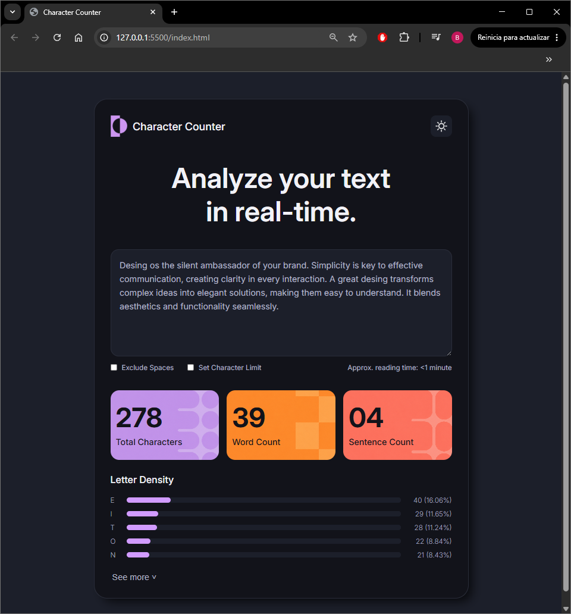
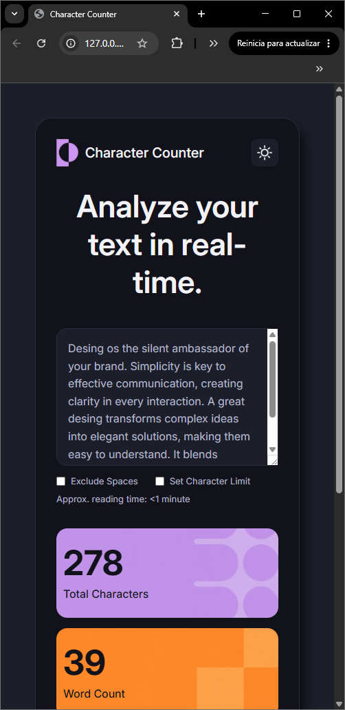
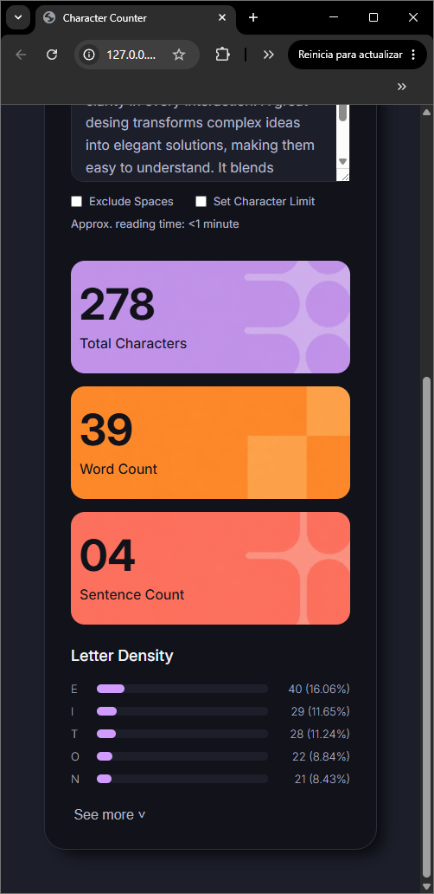

# Proyecto de Maquetado Web
## Character counter (HTML + CSS)

### 1. Objetivo del proyecto
El objetivo de este proyecto es replicar visualmente el diseño mostrado en la imagen de referencia utilizando unicamente HTML y CSS, **sin JavaScript.**

### 2. Tecnologias utilizadas
- HTML5 (index.html).
- CSS3 (style.css).
- ChatGPT (creacion de imagenes, fondos e iconos).
- https://www.remove.bg/ (remover fondo de imagenes e iconos).

### 3. Como organizaron el HTML
El HTML fue estructurado utilizando etiquetas semanticas:
1. `<header>`: logo, nombre, boton para cambiar de tema.
2. `<section>`: hero principal ("hero"), controles debajo del textarea ("controls"), tarjetas metricas ("metrics") y seccion "letter density" ("letter-density").
3. Todas estas etiquetas quedaron envueltas dentro de un `
` (card), para asemejar visualmente el proyecto a un widget.
4. `<button>`: al final nos encuentramos un boton _"See more"_.
---
***Secciones***
- `<section>` "hero": contiene un `<h1>` y un `<textarea>`.
- `<section>` "controls": contiene dos `
`, el primero contiene dos `<input>` de tipo _checkbox_; el segundo un solo `
`.
- `<section>` "metrics": contiene tres `
` para cada una de las cards, y cada uno de estos contiene dos `
` con los datos _(numeros)_.
- `<section>` "letter-density": primero contiene un `<h3>` con el titulo de esta seccion; segundo un `
` que contiene a todos los items y dentro de cada item los `
` para los textos de letras y porcentajes y una etiqueta `<progress>` para las barras de carga.

### 4. Como resolvieron el CSS
1. Primero se hizo un reseteo basico, seguido de la creacion de variables `:root` _(llegado al final del proyecto se borraron las variables que se utlizarian para el fondo de las card de metrics, porque se logro crear las imagenes de fondo)_.
2. Se estilo el `<body>` seguido del `
` principal para asemejar el proyecto a un widget, como los que se vienen trabajando en clase, usando flexbox para alineaciones simples.
3. Luego se fue estilando `<section>` a `<section>` de arriba hacia abajo, siguiendo con lo recomendado de estilar ***"de afuera hacia adentro y de arriba hacia abajo".***
4. Se estilo el `<button>` "see more", seguido de utilizar la psedoclase `:hover` para un efecto interactivo en este boton y el de theme del `<header>`.
5. Por ultimo se agrego un diseño responsive basico con "media queries" para adaptar el diseño a diferentes tamaños de pantalla.

### 5. Dificultades encontradas
Probablemente lo que mas tiempo me llevo es investigar como como estilar la barra de progreso `<progress>`, no sabia que habia propiedades que aplicaban segun el navegador donde se ejecuten.
Tambien me llevo tiempo acomodar bien las imagenes que contiene el `<header>`; tuve que cambiarlas por nuevas versiones porque me habia olvidado de remover el fondo de las imagenes creadas por IA, ademas de recortarlas para que se acomoden a lo que necesitaba.
Varias veces tuve que volver a editar el `index` agregando nuevos `
` y clases que me habia olvidado en un principio, y que a la hora de estilar te das cuenta lo que hay que cambiar para obtener el mejor resultado posible.
Por falta de tiempo tuve que resignar la investigacion e implementacion de estilos para los checkbox, y algo de interaccion con las tarjetas de las metricas.

### 6. Capturas del resultado final

---

---

---

